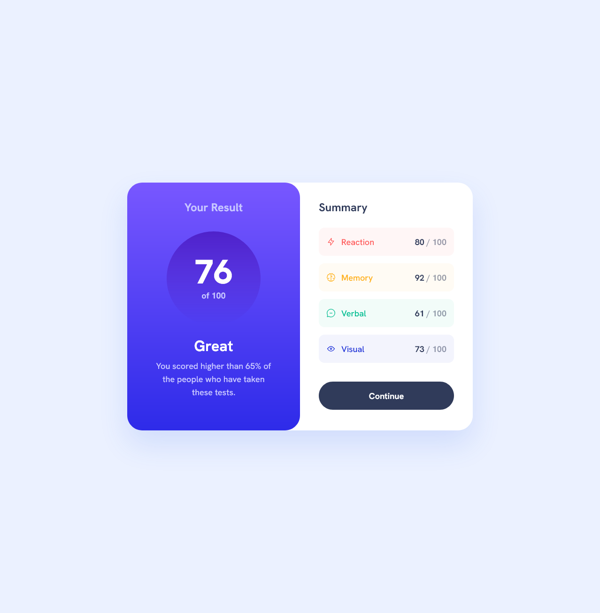

# Frontend Mentor - Results summary component solution

This is a solution to the [Results summary component challenge on Frontend Mentor](https://www.frontendmentor.io/challenges/results-summary-component-CE_K6s0maV). Frontend Mentor challenges help you improve your coding skills by building realistic projects.

### Screenshot

### Links

- Solution URL: [Solution URL here](https://github.com/NDK1195/results-summary-component)
- Live Site URL: [Live site URL here](https://ndk1195.github.io/results-summary-component/)

### Built with

- HTML5
- Tailwind CSS
